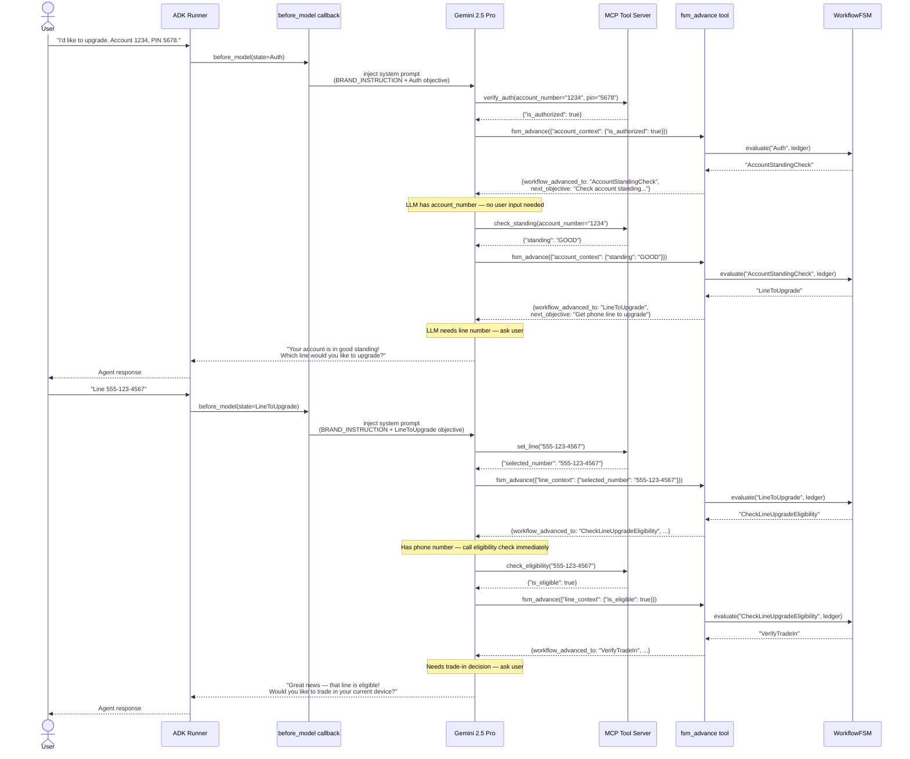
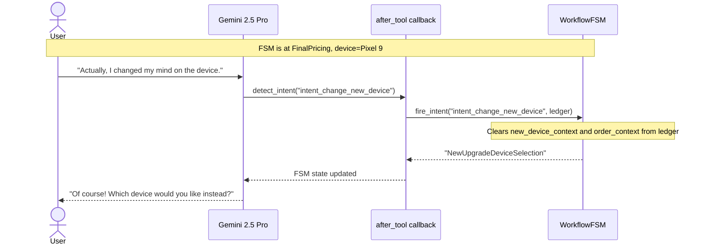

# Telco ADK + FSM POC

A phone-upgrade workflow agent built with **Google ADK**, a **YAML-driven FSM**, and **MCP tools**. The LLM handles conversation and semantic reasoning; the FSM enforces deterministic business rules. Zero Python changes required when business rules evolve.

---

## Table of Contents

1. [Architecture Overview](#architecture-overview)
2. [How LLM and FSM Work Together](#how-llm-and-fsm-work-together)
3. [Code Flow — Sequence Diagram](#code-flow--sequence-diagram)
4. [Key Design Decisions](#key-design-decisions)
5. [Project Structure](#project-structure)
6. [Setup and Running Locally](#setup-and-running-locally)
7. [Testing](#testing)
8. [GCP Deployment](#gcp-deployment)

---

## Architecture Overview

The system has three layers that cleanly separate concerns:

```
┌──────────────────────────────────────────────────────────────────┐
│  LLM LAYER  (Google Gemini 2.5 Pro via ADK)                     │
│  • Converses with the user naturally                             │
│  • Decides which MCP tool to call based on the current objective │
│  • Semantically maps tool response fields → structured data      │
│  • Calls fsm_advance after every tool call                       │
└────────────────────────────┬─────────────────────────────────────┘
                             │ fsm_advance(data)
┌────────────────────────────▼─────────────────────────────────────┐
│  BRIDGE LAYER  (Python — agent.py, fully domain-agnostic)        │
│  • before_model:  injects brand persona + current state          │
│                   objective into system prompt each turn         │
│  • fsm_advance:   ADK FunctionTool — normalises booleans,        │
│                   merges data into ledger, calls FSM evaluate,   │
│                   returns next objective to LLM                  │
│  • after_tool:    handles detect_intent (change-of-mind only)    │
│  • after_model:   fallback JSON-block parser for resilience      │
└────────────────────────────┬─────────────────────────────────────┘
                             │ ledger dict
┌────────────────────────────▼─────────────────────────────────────┐
│  FSM LAYER  (fsm.py + config/phone_upgrade.yaml)                 │
│  • All states, objectives, and transition conditions in YAML     │
│  • Conditions evaluated by simpleeval against the ledger         │
│  • Stateless: current state stored in ADK session, not in FSM   │
│  • Global intents (change-of-mind) fire from any state           │
└──────────────────────────────────────────────────────────────────┘
```

### FSM States

Happy path:
```
Auth → AccountStandingCheck → LineToUpgrade → CheckLineUpgradeEligibility
     → VerifyTradeIn → DeviceTradeInChecks → TradeInPricing
     → NewUpgradeDeviceSelection → NewUpgradeDevicePricing
     → FinalPricing → ProcessOrder → EndSuccess
```

Error terminals: `EndUnauthorized`, `EndBadStanding`, `EndNotEligible`, `EndOrderFailed`

Global intents (fire from any state): `intent_change_line`, `intent_change_trade_in_device`, `intent_change_new_device`

---

## How LLM and FSM Work Together

### The Core Loop

Every user turn follows this loop inside a single `runner.run_async` call:

```
LLM calls MCP tool  →  LLM calls fsm_advance(data)
       ↑                          ↓
       │              FSM advances, returns next objective
       │                          ↓
       └──── LLM has data? ───── Yes: call next tool
                                  No: ask user, end turn
```

### What Each Component Owns

| Concern | Owner |
|---|---|
| User conversation and tone | LLM + `BRAND_INSTRUCTION` constant |
| Which tool to call | LLM (infers from objective + tool docstrings) |
| Semantic mapping of tool response → ledger | LLM |
| When to move to the next state | FSM (`evaluate` via `fsm_advance` tool) |
| Transition conditions | YAML `condition_string` fields |
| Business rules and workflow steps | YAML only — zero Python |

### Slot-Filling

If the user provides information for multiple steps upfront (e.g. "My account is 1234, PIN 5678, I want to upgrade line 555-3456 and I don't want to trade in"), the LLM chains tool calls within a single turn without asking for details it already has:

```
Turn 1:  verify_auth → fsm_advance → check_standing → fsm_advance
         → set_line → fsm_advance → check_eligibility → fsm_advance
         → set_trade_in_preference → fsm_advance
         FSM reaches NewUpgradeDeviceSelection
         Agent asks: "Which device would you like?"
```

### System Prompt Structure (every turn)

```
┌─────────────────────────────────────────────┐
│  BRAND_INSTRUCTION  (constant)              │
│  Agent name, tone, empathy rules,           │
│  Verizon brand voice guidelines             │
└─────────────────────────────────────────────┘
                    +
┌─────────────────────────────────────────────┐
│  PER-STATE SECTION  (dynamic, from YAML)    │
│  CURRENT STATE: Auth                        │
│  CURRENT OBJECTIVE: Verify the user…        │
│  Workflow rules + fsm_advance example       │
└─────────────────────────────────────────────┘
```

To change brand voice → edit `BRAND_INSTRUCTION` in `agent.py`.
To change what happens at a step → edit the YAML `objective` for that state.

### The Ledger

A running dict in ADK session state that accumulates all collected data:

```python
{
    "account_context":    {"is_authorized": True, "standing": "GOOD"},
    "line_context":       {"selected_number": "555-1234", "is_eligible": True},
    "trade_in_context":   {"wants_trade_in": True, "final_condition": "Good", "quote_value": 200},
    "new_device_context": {"selection": "iPhone 16", "price": 1000},
    "order_context":      {"user_confirmed": True, "order_id": "ORD-999888777"}
}
```

FSM conditions in YAML evaluate against this ledger:
```yaml
condition_string: "context['account_context'].get('is_authorized') == True"
```

---

## Code Flow — Sequence Diagram



### Change-of-Mind Flow



---

## Key Design Decisions

### 1. Zero Python Changes for Business Rule Updates

All business logic lives in `config/phone_upgrade.yaml`:
- State names and objectives
- Transition conditions (`condition_string`)
- Change-of-mind memory wipe lists

Python code has no knowledge of specific states, field names, or conditions.

### 2. LLM as Semantic Bridge

Tool responses may use different field names than the ledger schema. The LLM maps them semantically. For example, if `verify_auth` returns `{"authorization_status": "GRANTED"}`, the LLM understands this maps to `{"account_context": {"is_authorized": true}}` — no Python parsing code required.

### 3. FSM as Deterministic Guard Rail

The LLM cannot decide to skip states or go backwards. Every state transition is explicitly conditioned in YAML. Hallucination cannot advance the workflow — only verified data in the ledger can.

### 4. `fsm_advance` as Explicit Handoff

The LLM explicitly calls `fsm_advance` after each tool call. This is the defined boundary between the LLM layer and the FSM layer. The FSM response tells the LLM exactly what comes next, so it always knows its current objective without guessing.

### 5. FSM is Stateless

`WorkflowFSM` holds no session state. The current FSM state name and the ledger are stored in ADK session state (`tool_context.state`). This makes the FSM thread-safe and trivially scalable.

### 6. MCP for Tool Transport

Domain tools run in a separate FastMCP ASGI server on port 8080. The agent connects via Streamable HTTP. This means tools can be updated, restarted, or replaced independently of the agent.

---

## Project Structure

```
config/
  phone_upgrade.yaml          # ALL business logic: states, objectives,
                              #   transitions, conditions — no Python needed

mock_mcp_server/
  server.py                   # FastMCP ASGI server with 12 telco tools:
                              #   verify_auth, check_standing, set_line,
                              #   check_eligibility, set_trade_in_preference,
                              #   record_condition, pricing, select_device,
                              #   confirm_order, decline_order, submit_order,
                              #   detect_intent

src/
  agents/
    __init__.py               # Exports root_agent for ADK discovery
    agent.py                  # ADK root_agent definition
                              #   BRAND_INSTRUCTION — global brand voice constant
                              #   fsm_advance — ADK FunctionTool (LLM↔FSM handoff)
                              #   before_model — injects system prompt each turn
                              #   after_tool — handles detect_intent only
                              #   after_model — fallback JSON-block parser
    orchestrator/
      __init__.py
      fsm.py                  # WorkflowFSM (stateless) + FlowController
                              #   Loads YAML, builds transitions Machine,
                              #   exposes evaluate() and fire_intent()

deploy/
  app.py                      # AdkApp wrapper for Agent Engine deployment

tests/
  test_fsm.py                 # 20 FSM unit tests — no LLM, no server needed
  test_agent_flow.py          # 48 integration tests — callbacks + fsm_advance
                              #   (no LLM needed; MCP server optional)
  test_e2e_live.py            # 4 E2E scenarios — real Gemini LLM + MCP server
                              #   Logs written to logs/flow-test.log
```

---

## Setup and Running Locally

### Requirements

- Python 3.14+
- Poetry (`/usr/local/bin/poetry` on this machine)
- Google credentials (see below)

### Install

```bash
git clone <repo-url>
cd rules-to-agent
/usr/local/bin/poetry install
```

### Credentials — pick one

**Option A — Google AI Studio (simplest, no GCP project needed)**
```bash
export GOOGLE_API_KEY=your_key_here
# Get a key at: https://aistudio.google.com/app/apikey
```

**Option B — Vertex AI**
```bash
gcloud auth application-default login
export GOOGLE_GENAI_USE_VERTEXAI=true
export GOOGLE_CLOUD_PROJECT=tmeg-working-demos
export GOOGLE_CLOUD_LOCATION=us-central1
```

### Run

Open two terminals:

**Terminal 1 — MCP tool server**
```bash
/usr/local/bin/poetry run uvicorn mock_mcp_server.server:app --port 8080
# Expected: "StreamableHTTP session manager started"
```

**Terminal 2 — ADK web UI**
```bash
/usr/local/bin/poetry run adk web src/
# Opens http://localhost:8000 — chat UI + trace inspector
```

### Try it in the browser

| Scenario | Input | Expected outcome |
|---|---|---|
| Happy path | Account `1234`, any PIN | Reaches `EndSuccess` with `order_id: ORD-999888777` |
| Unauthorized | Account `9999` | Reaches `EndUnauthorized` |
| Change device | Say "change my device" at FinalPricing | FSM rewinds to `NewUpgradeDeviceSelection`, trade-in preserved |
| Change line | Say "change my line" at any point | FSM rewinds to `LineToUpgrade`, all downstream data cleared |

**Example conversation showing slot-filling:**
```
User:  Hi, I want to upgrade. Account 1234, PIN 5678, line 555-9876, no trade-in.

Agent: [calls verify_auth → fsm_advance → check_standing → fsm_advance
        → set_line → fsm_advance → check_eligibility → fsm_advance
        → set_trade_in_preference → fsm_advance — all in one turn]

       "Welcome to Verizon! Your account is verified and your line is eligible
        for an upgrade. Which new device would you like?"
```

---

## Testing

Three test layers — each can run independently:

```
test_fsm.py          ← fastest, no dependencies
test_agent_flow.py   ← needs source only (MCP optional)
test_e2e_live.py     ← needs credentials + MCP server
```

### FSM unit tests — no LLM, no server

```bash
/usr/local/bin/poetry run pytest tests/test_fsm.py -v
```

Tests all 15 FSM states, all transitions, and all global intent rewinds. (21 tests)

### Integration tests — no LLM

```bash
# Without MCP server (skips MCP smoke tests)
/usr/local/bin/poetry run pytest tests/test_agent_flow.py -v -k "not TestMCPServer"

# With MCP server running on :8080
/usr/local/bin/poetry run pytest tests/test_agent_flow.py -v
```

Tests the full callback pipeline (`before_model`, `after_tool`, `after_model`, `fsm_advance`) with mock ADK objects — no real LLM call needed.

### E2E live tests — real LLM + real MCP server

Requires credentials and MCP server running.

```bash
# All 4 scenarios
/usr/local/bin/poetry run pytest tests/test_e2e_live.py -v -s

# Individual scenarios
/usr/local/bin/poetry run pytest tests/test_e2e_live.py::test_happy_path_with_trade_in -v -s
/usr/local/bin/poetry run pytest tests/test_e2e_live.py::test_no_trade_in_path -v -s
/usr/local/bin/poetry run pytest tests/test_e2e_live.py::test_unauthorized_path -v -s
/usr/local/bin/poetry run pytest tests/test_e2e_live.py::test_change_of_mind -v -s

# Interactive menu
/usr/local/bin/poetry run python tests/test_e2e_live.py
```

Logs are written to `logs/flow-test.log` (overwritten each run).

**Example log output:**
```
[USER]  Account 1234, PIN 5678.
[FSM]   Auth → AccountStandingCheck | data: {'account_context': {'is_authorized': True}}
[FSM]   AccountStandingCheck → LineToUpgrade | data: {'account_context': {'standing': 'GOOD'}}
  [TOOLS] verify_auth → fsm_advance → check_standing → fsm_advance
  [FSM]   LineToUpgrade
[AGENT] Your account is verified and in good standing — great news!
        Which phone line would you like to upgrade today?
```

### Current test counts

| Suite | Tests | Dependencies |
|---|---|---|
| `test_fsm.py` | 21 | None |
| `test_agent_flow.py` | 48 | Source only |
| `test_e2e_live.py` | 4 | Credentials + MCP |

---

## GCP Deployment

```bash
/usr/local/bin/poetry run python deploy/app.py
```

- **Project:** `tmeg-working-demos`
- **Location:** `us-central1`
- **Model:** `gemini-2.5-pro`

The `deploy/app.py` wraps `root_agent` in an `AdkApp` for Agent Engine. All session state management, scaling, and authentication are handled by Agent Engine — no changes to agent code required.
